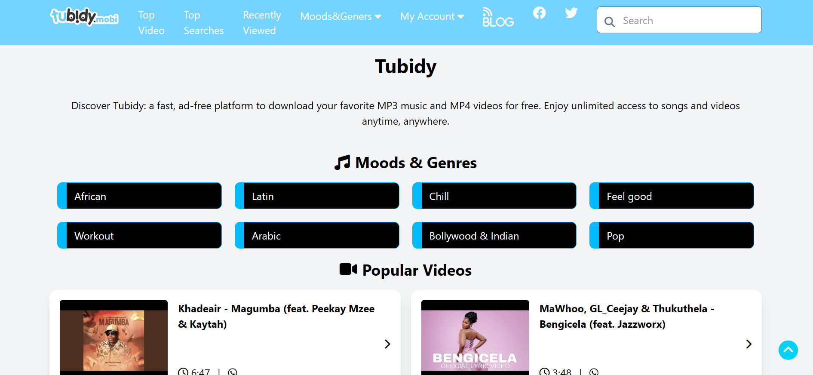

## Clone of Tubidy landing Page

## Table of contents

- [Overview](#overview)
  - [Screenshot](#screenshot)
  - [Links](#links)
- [My process](#my-process)
  - [Built with](#built-with)
  - [What I learned](#what-i-learned)
  - [Continued development](#continued-development)
  - [Useful resources](#useful-resources)
- [Author](#author)


## Overview

### Screenshot

 

### Links

- Solution URL: []()
- Live Site URL: []()

## My process

### Built with

- Semantic HTML5 markup
- Tailwind CSS
- JavaScript

### What I learned
    Working with tailwind css has made styling alot more easier and faster.Even though im still on the learning process on how to use tailwind better,i learnt alot; from styling of my text to its responsivisity... Just like adventure,knowing many more are to come...
 
 some cool tailwind styles i liked,used on my nave bar and moblie view nav when viewed on mobile devices
 ```css
<nav class="hidden lg:flex px-4 lg:px-20 py-3 bg-sky-300 text-white sticky top-0 z-50 border-b">
        <div class="flex flex-wrap item-center justify-between w-full gap-4">

 
<div class="lg:hidden flex justify-between items-center px-4 py-3 bg-sky-300 sticky top-0 z-50">
    
    <button id="mobileMenuButton" class="text-2xl focus:outline-none">
      <i class="fas fa-bars"></i>
    </button>
  </div>
```

### Continued development
Focusing on improving my skill in using Tailwind for styling...until I become best at it...

### Useful resources

- [Sourse1]( https://www.coursera.org/) - This helped me for my foundations in how to use html and css effectively. I really liked their pattern of teaching and will use it going forward.

- [Source2]( https://tailwindcss.com/) - This helped me to get the necessary syntaxs on how and where to use my styles.

- [Sourse3](https://fontawesome.com/) - This helped me ing getting the icons i needed for the webpage (i.e twitter,facebook, etc.)
## Author

- Website - [Okorie PraiseGod . E.]()
- LinkedIn - [Peolite1](https://www.linkedin.com/in/praisegodebubechukwu-392613260?lipi=urn%3Ali%3Apage%3Ad_flagship3_profile_view_base_contact_details%3BMt%2FHeL33RH%2BaGvs4pZiXFQ%3D%3D)
- Twitter - [@prai79461](https://x.com/prai79461)

